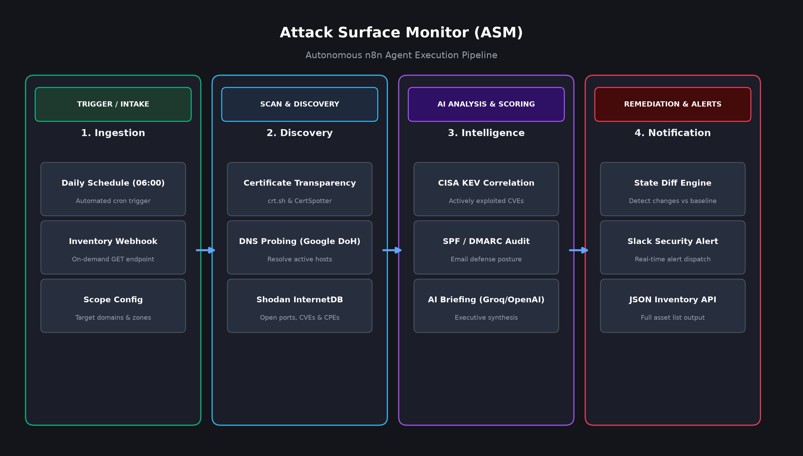

# 🛰️ AI-Powered Attack Surface Monitor (ASM)

## 📌 Overview

The **Attack Surface Monitor (ASM)** is an autonomous cybersecurity n8n agent workflow that continuously scans, maps, and tracks an organization's public external perimeter. By combining Certificate Transparency (CT) log aggregation, DNS-over-HTTPS probing, passive exposure intelligence, and CISA Known Exploited Vulnerabilities (KEV) correlation, it detects exposed assets, open ports, and risky configurations.

It establishes a baseline on its initial run and alerts security teams only when changes, newly discovered subdomains, or actionable security risks emerge.

### Workflow Architecture

## 🚀 What It Achieves

1. **Automated Perimeter Discovery:** Continuously queries Certificate Transparency logs via `crt.sh` and `CertSpotter` to discover newly registered and historical subdomains.
2. **Active Resolution & Service Verification:** Resolves subdomains using Google DNS-over-HTTPS and validates live HTTP/HTTPS status.
3. **Passive Threat & Exposure Intelligence:** Enriches discovered IP addresses via Shodan InternetDB to identify open ports, common vulnerabilities (CVEs), and CPEs without requiring paid API keys.
4. **Vulnerability Prioritization:** Automatically cross-references detected open services against the CISA KEV (Known Exploited Vulnerabilities) catalog.
5. **DNS & Email Posture Auditing:** Verifies critical email security records including SPF and DMARC enforcement.
6. **AI-Powered Executive Briefings:** Uses Groq/OpenAI to synthesize technical telemetry into concise, actionable executive briefings for Slack.
7. **Asset Inventory On-Demand:** Serves an on-demand REST endpoint (`GET /webhook/asm/inventory`) returning the real-time asset inventory and open findings in JSON.

## 🛠️ Features at a Glance

* **🛰️ Multi-Source CT Ingestion:** Real-time log monitoring prevents blind spots from shadow IT or forgotten staging subdomains.
* **🌐 High-Speed DNS & HTTPS Probes:** Fast, non-intrusive service health verification.
* **⚡ Shodan InternetDB Integration:** Instant detection of exposed database ports, remote desktop services, and unpatched CVEs.
* **🚨 Delta & Change Alerting:** Prevents notification fatigue by comparing findings against historical baseline state.
* **💬 Structured Slack Alerts:** Richly formatted Slack cards with severity badges, vulnerability details, and recommended fixes.
* **📦 Asset Inventory API:** Seamless integration with SIEMs, CMDBs, or external ticketing systems.

## ⚙️ Usage Instructions

### 1. Import the Workflow
1. Open your **n8n** instance.
2. Click on **Add Workflow** > **Import from File**.
3. Select [`Attack Surface Monitor (ASM).json`](./Attack%20Surface%20Monitor%20(ASM).json).

### 2. Configure Credentials & Scope
Set up the following configurations within n8n:
* **Scope Config Node:** Open the `Scope Config` node and specify your target root `domains` (e.g. `["example.com"]`).
* **LLM Credential:** Connect your OpenAI or Groq API credential to the `Groq Chat Model` / `AI Briefing` node.
* **Slack Credential:** Attach a Slack bot token (`chat:write`) to the `Send Slack Alert` node and configure the alert channel ID.
* **(Optional) Webhook Authentication:** Set a Header Auth secret on the `Inventory Webhook` node.

### 3. Establish Baseline & Activate
1. Click **Execute workflow** once manually to run the initial scan and establish your asset baseline.
2. Toggle the workflow switch to **Active** to enable the automated daily 06:00 UTC schedule trigger.

---
*Stay secure! This workflow is part of the Cybersecurity AI Agents toolkit.*
