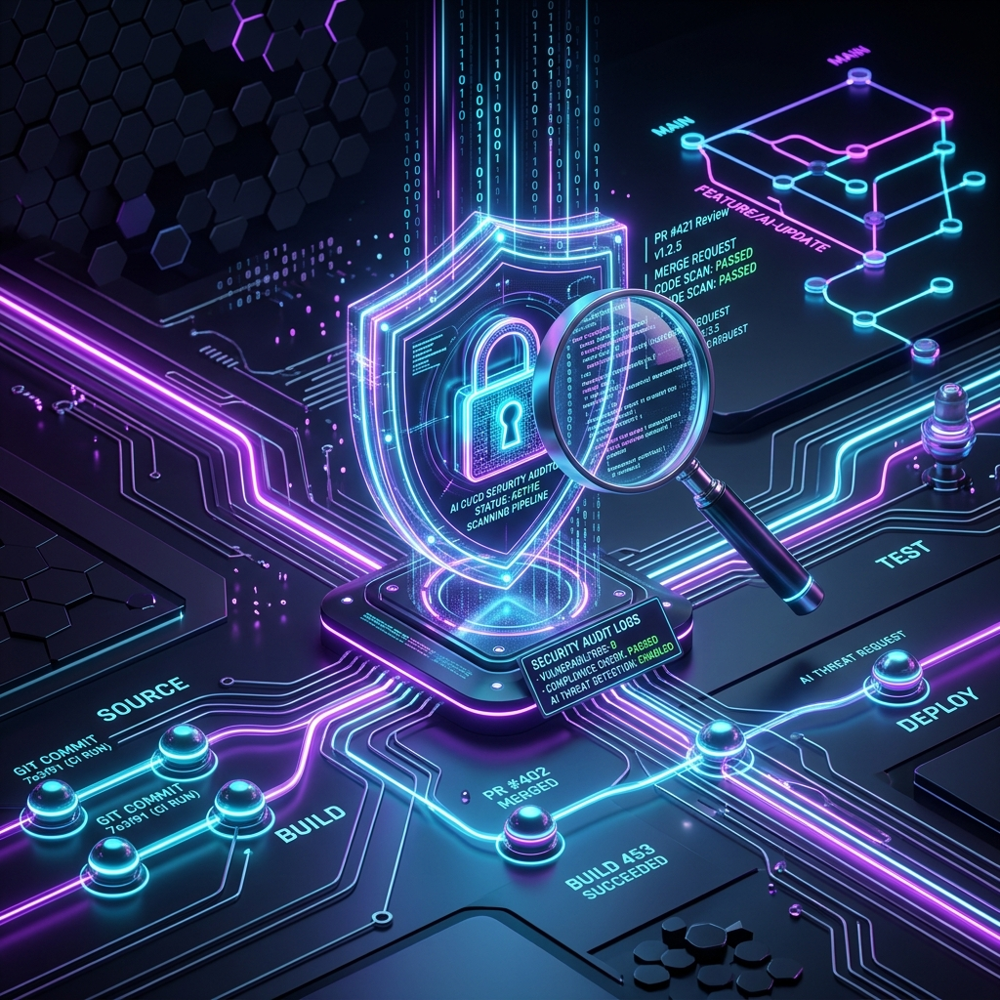
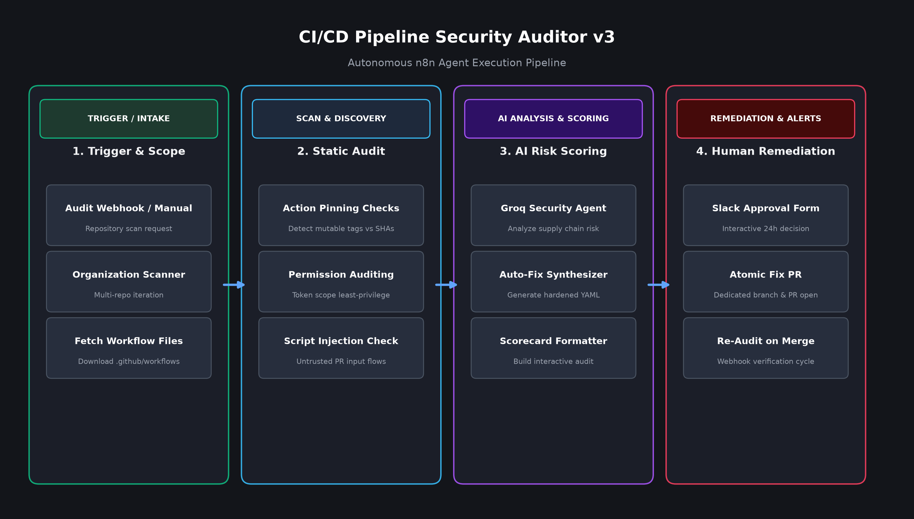

# ⚙️ AI CI/CD Pipeline Security Auditor v3

## 📌 Overview

The **CI/CD Pipeline Security Auditor v3** is an enterprise-grade autonomous security engineer built in n8n. It audits GitHub Actions CI/CD workflows for supply chain risks, script injection vectors, insecure token scopes, and unpinned dependencies. 

Rather than merely generating static reports, it features an interactive **Human-in-the-Loop Slack approval workflow** that allows security engineers to approve automated remediation Pull Requests with a single click.

### Workflow Architecture

## 🚀 What It Achieves

1. **GitHub Workflow Static Analysis:** Scans all workflow definitions (`.github/workflows/*.yml`) across single repos or entire GitHub organizations.
2. **Supply Chain Hardening:** Identifies unpinned 3rd-party GitHub Actions and flags risks associated with using mutable branch or version tags instead of immutable commit SHAs.
3. **Privilege & Permission Auditing:** Verifies that `GITHUB_TOKEN` permissions adhere to the principle of least privilege, preventing default broad write access.
4. **Script Injection & Context Sanitization:** Pinpoints dangerous pattern expressions like `github.event.pull_request.title` or `pull_request_target` triggers in inline run steps.
5. **Interactive Slack Decision Flow:** Dispatches a structured Slack scorecard with interactive decision buttons:
   * **🚀 Create Fix PR:** Creates an atomic commit on a dedicated branch with hardened workflow syntax and opens a Pull Request.
   * **🎫 Open Tracking Issue:** Automatically logs a tracking issue on GitHub with line-level findings and remediation steps.
   * **🛡️ Accept Risk:** Persists the accepted risk to workflow static data for audit compliance.
6. **Closed-Loop Verification:** Provides a re-audit webhook that automatically re-evaluates the pipeline upon Pull Request merge to verify the fix.

## 🛠️ Features at a Glance

* **🔍 Single Repo & Org-Wide Audits:** Run ad-hoc audits or batch audit all active organization repositories.
* **🧠 Groq LLM Agent:** Generates intelligent, syntax-valid YAML hardening recommendations tailored to each pipeline.
* **⏱️ 24-Hour Approval Window:** Slack interactive forms remain valid for 24 hours to fit into incident and change management workflows.
* **🔒 Safe Branching Guardrails:** Fixes are committed to isolated branches (`security/harden-workflows-*`) and never directly to default branches.
* **🔄 Re-audit on Merge:** Automates compliance reporting by verifying pipeline posture after fixes are merged.

## ⚙️ Usage Instructions

### 1. Import the Workflow
1. Open your **n8n** instance.
2. Click on **Add Workflow** > **Import from File**.
3. Select [`CI CD Pipeline Security.json`](./CI%20CD%20Pipeline%20Security.json).

### 2. Configure Credentials
Set up the following credentials in n8n:
* **GitHub READ Credential:** Personal Access Token (PAT) with repository read access.
* **GitHub WRITE Credential:** Separate PAT with write permissions for `contents`, `pull_requests`, `workflows`, and `issues`.
* **Groq API Key:** For the AI reasoning and YAML remediation agent.
* **Slack API Credential:** Bot token with `chat:write` scope and the target Slack channel ID.

### 3. Setup Re-Audit Webhook (Optional)
In your target GitHub repository:
1. Navigate to **Settings** > **Webhooks** > **Add webhook**.
2. Set the Payload URL to your n8n re-audit webhook path.
3. Select the **Pull requests** event (`closed`/`merged`).

---
*Stay secure! This workflow is part of the Cybersecurity AI Agents toolkit.*
