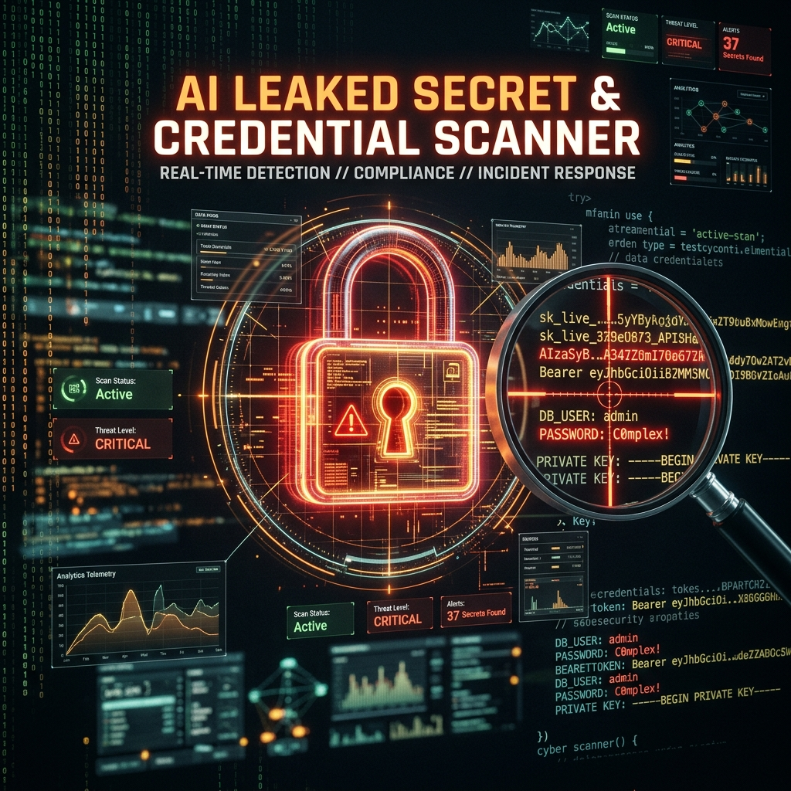
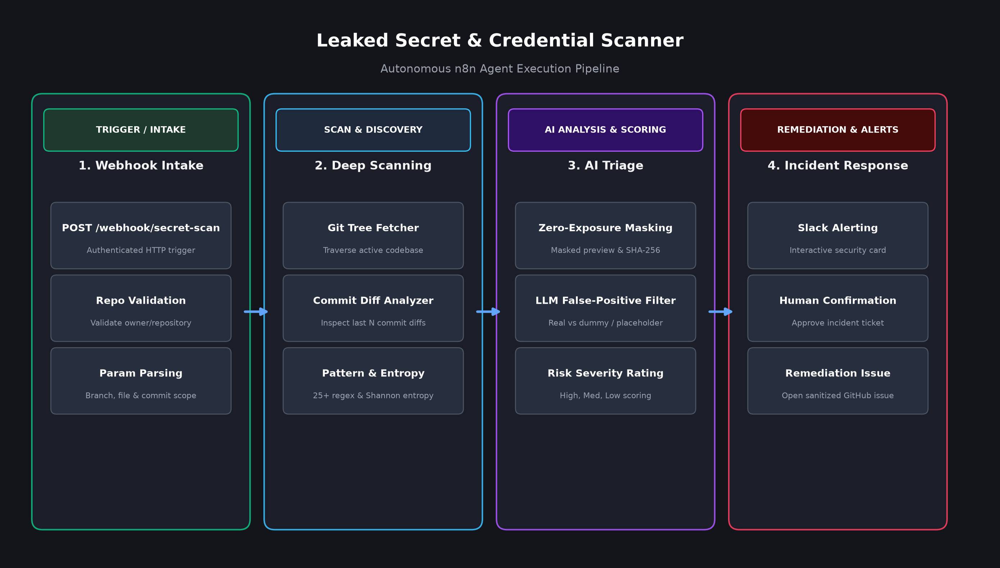

# 🔐 AI Leaked Secret & Credential Scanner



## 📌 Overview

The **Leaked Secret & Credential Scanner** is an autonomous n8n security agent that deeply inspects GitHub repositories and recent git commit history diffs to uncover exposed secrets, private keys, authentication tokens, and sensitive files.

To prevent alert fatigue, it pairs high-speed pattern and Shannon entropy detection with an **AI Triage Layer** that accurately differentiates between real production keys, test fixtures, and template placeholders—without ever leaking raw secret values to the LLM.

### Workflow Architecture


## 🚀 What It Achieves

1. **Dual-Layer Code & Git History Inspection:**
   * **Tree Scan:** Traverses the active repository tree, filtering out binaries, vendor packages, and lockfiles.
   * **Commit Diff Scan:** Inspects the diffs of the last *N* commits to catch secrets that were accidentally committed and later removed in a subsequent commit.
2. **Multi-Engine Pattern Detection:**
   * **25+ Provider Patterns:** Identifies AWS Access Keys, GitHub Personal Access Tokens, Slack Webhooks, OpenAI API Keys, Stripe Keys, SSH Private Keys, JWTs, and database connection strings.
   * **Shannon Entropy Analysis:** Catches custom or unstructured high-entropy strings that evade fixed prefix regexes.
   * **Sensitive File Detection:** Flags exposed `.env`, `.tfstate`, `id_rsa`, `keystore`, and configuration files.
3. **Zero-Knowledge Privacy Architecture:**
   * Raw secret values are **strictly redacted** and never written to logs or sent across LLM APIs.
   * Only masked prefixes/suffixes (e.g. `ghp_****...abcd`) and non-reversible SHA fingerprints are handled.
4. **AI-Powered False Positive Filtering:** Uses OpenAI models to evaluate code context, determining whether a detected pattern is an active credential or a benign mock/example.
5. **Interactive Remediation Workflow:** Delivers structured alerts to Slack with instant interactive buttons to dispatch sanitized remediation tickets directly to GitHub Issues.

## 🛠️ Features at a Glance

* **⚡ On-Demand HTTP Webhook:** Easily integrated into existing CI/CD pipelines, pre-commit hooks, or developer portals.
* **🔒 Privacy-First Design:** Complete protection against leaking raw tokens to external models or logs.
* **🧠 Context-Aware AI Triage:** Eliminates false alarms caused by unit tests, documentation examples, and fixtures.
* **📬 Interactive Slack Cards:** Detailed incident context with severity scoring (Critical, High, Medium, Low).
* **🎫 Automated GitHub Issue Creation:** Pre-fills remediation issues with file paths, commit SHAs, masked previews, and rotation instructions upon human approval.

## ⚙️ Usage Instructions

### 1. Import the Workflow
1. Open your **n8n** instance.
2. Click on **Add Workflow** > **Import from File**.
3. Select [`Leaked Secret Scanner.json`](./Leaked%20Secret%20Scanner.json).

### 2. Configure Credentials
Set up the following credentials in n8n:
* **GitHub Credential:** Personal Access Token with repository read access (and `issues:write` for remediation issue logging).
* **OpenAI API Key:** For the AI triage and context validation node.
* **Slack API Credential:** Bot token with `chat:write` scope and target channel ID.
* **Webhook Header Auth:** Set your private `x-api-key` on the intake webhook.

### 3. Triggering Scans via Webhook
Trigger scans programmatically with a simple HTTP POST request:
```bash
curl -X POST https://your-n8n-instance/webhook/secret-scan \
  -H "x-api-key: YOUR_WEBHOOK_KEY" \
  -H "Content-Type: application/json" \
  -d '{
    "repo": "owner/repository-name",
    "branch": "main",
    "max_files": 250,
    "history_commits": 20
  }'
```

---
*Stay secure! This workflow is part of the Cybersecurity AI Agents toolkit.*
