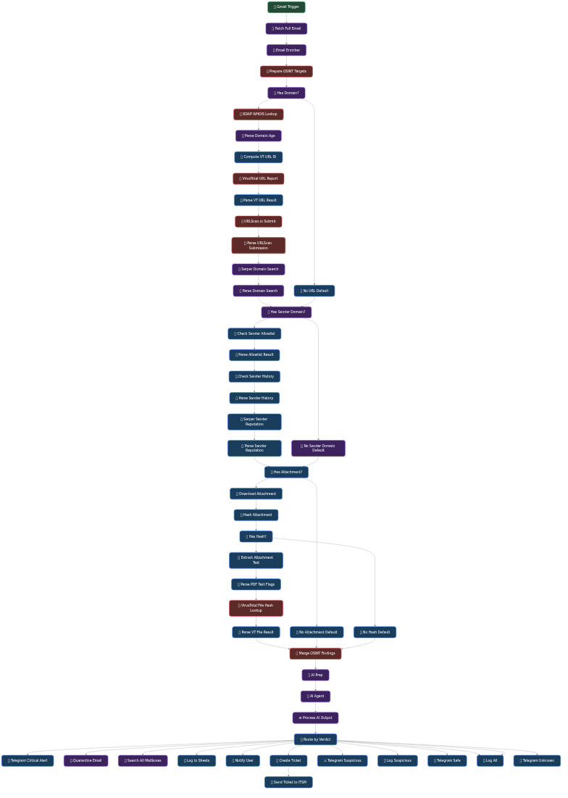

# 🛡️ AI-Powered Phishing Triage Agent

## 📌 Overview

The **Phishing Triage Agent** is a fully automated n8n workflow designed to act as the first line of defense against email-borne threats. It automatically ingests, analyzes, and responds to potential phishing emails, drastically reducing the manual workload on your Security Operations Center (SOC).

### Workflow Architecture

## 🚀 What It Achieves

This workflow provides an end-to-end automated pipeline for handling suspicious emails:
1. **Automated Intake:** Monitors a designated inbox (e.g., `phishing@yourcompany.com`) for new reported emails.
2. **Intelligent Parsing:** Uses an advanced Large Language Model (Groq) to intelligently extract Indicators of Compromise (IOCs) such as sender domains, suspicious links, and urgent language.
3. **OSINT Verification:** Automatically checks extracted domains and URLs against threat intelligence databases like **VirusTotal** and **URLScan.io** to verify malicious intent.
4. **Automated Triage & Routing:** Categorizes the threat into Critical, Suspicious, Safe, or Unknown based on the AI and OSINT analysis.
5. **Real-time Alerting:** Dispatches instant notifications to the security team via Telegram, ensuring rapid response to critical threats.
6. **Ticketing & Auditing:** Logs all incidents directly into Google Sheets and creates IT Service Management (ITSM) tickets for tracking.

## 🛠️ Features at a Glance

*   **📧 Gmail Integration:** Seamlessly triggers on new incoming emails or forwarded reports.
*   **🧠 LLM-Driven Analysis:** Employs Groq AI to understand context and intent, catching highly targeted spear-phishing that traditional filters miss.
*   **🦠 VirusTotal & URLScan API:** Deep-dives into links to detect zero-day malware and newly registered credential-harvesting domains.
*   **📱 Multi-Channel Notifications:** Granular Telegram routing based on verdict severity.
*   **🎫 Auto-Ticketing:** Pre-fills ITSM tickets with all extracted IOCs and analysis summaries.
*   **📊 Centralized Logging:** Maintains a continuous audit log in Google Sheets for compliance and metric tracking.

## ⚙️ Usage Instructions

### 1. Import the Workflow
1. Open your n8n instance.
2. Click on **Add Workflow** > **Import from File**.
3. Select the `Phishing Triage.json` file.

### 2. Configure Credentials
You will need to set up the following credentials in n8n before the workflow can function:
*   **Gmail Account:** OAuth2 credentials to read the triage inbox.
*   **Groq API:** An API key for the Groq AI model.
*   **Telegram Bot:** A bot token and chat ID to receive alerts.
*   **VirusTotal API Key:** For URL and file scanning.
*   **URLScan.io API Key:** For sandboxed link analysis.
*   **Google Sheets Account:** OAuth2 credentials for the logging sheet.

### 3. Activate
*   Update the specific Telegram Chat IDs and Google Sheet IDs within the nodes.
*   Toggle the workflow to **Active** in the top right corner of the n8n canvas.

---
*Stay secure! This workflow is part of the Cybersecurity AI Agents toolkit.*
