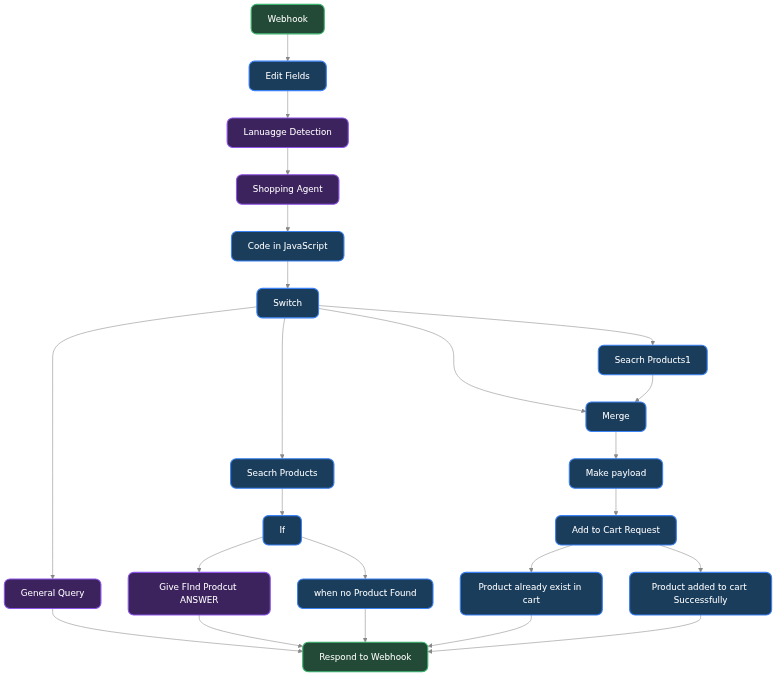

# 🛒 AI E-Commerce Chat & Support Agent

## 📌 Overview

The **E-Commerce Chat Agent** is a fully automated conversational AI workflow built in n8n. Designed to integrate directly with your storefront via Webhooks, it serves as an intelligent shopping assistant that can handle general customer queries, search for products, and seamlessly add items to a customer's cart—all powered by advanced Groq-based Large Language Models.

### Workflow Architecture

## 🚀 What It Achieves

This intelligent shopping assistant streamlines customer support and boosts sales by autonomously guiding users through the buying journey:
1. **Intelligent Intake:** Receives incoming chat messages via a Webhook trigger and immediately responds to acknowledge receipt.
2. **Language Detection & Routing:** Automatically detects the customer's language and processes their message using a specialized Shopping Agent.
3. **Intent Classification:** Employs an LLM Switch mechanism to route the conversation based on user intent (e.g., General Query vs. Product Search).
4. **Dynamic Product Search:** Can proactively search a product database using JavaScript-based filtering logic and present formatted results directly to the user.
5. **Automated Cart Management:** If a customer wishes to buy, the agent autonomously validates if the product is already in the cart. If not, it executes an "Add to Cart" API request.
6. **Graceful Fallbacks:** If a product isn't found, the agent gracefully informs the customer using conversational LLM generation.

## 🛠️ Features at a Glance

*   **⚡ Groq LLM Integration:** Utilizes blazing-fast Groq Chat Models for near-instantaneous conversational responses.
*   **🌐 Multi-Language Support:** Auto-detects user language to provide localized support.
*   **🛍️ Direct Store Integration:** Hooks directly into product search and shopping cart APIs.
*   **🔀 Intent-Based Routing:** Uses a switch node to separate casual chit-chat from high-intent purchase queries.
*   **🖥️ Custom JS Logic:** Employs JavaScript code nodes to parse complex payloads and format product cards beautifully.

## ⚙️ Usage Instructions

### 1. Import the Workflow
1. Open your n8n workspace.
2. Click on **Add Workflow** > **Import from File**.
3. Select the `Ecommerce Chat.json` file.

### 2. Configure Credentials
Update the nodes with your specific platform credentials:
*   **Groq API Key:** Required for all the Chat Model nodes to power the conversational AI.
*   **E-Commerce APIs:** Update the `Search Products` and `Add to Cart Request` nodes with your actual store endpoint URLs (e.g., Shopify, WooCommerce, or custom backend APIs).

### 3. Webhook Setup
*   Point your chat widget frontend to the **Webhook URL** provided by the first node.
*   Ensure your chat widget sends a JSON payload containing the user's message and session ID.
*   Set the workflow to **Active** to deploy your automated sales assistant!

---
*Built to revolutionize customer experience! Part of the Agentic-AI repository.*
