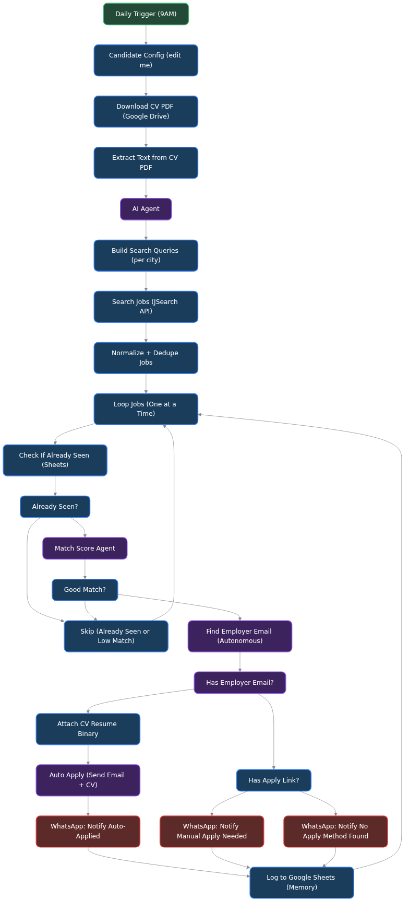

# 💼 AI-Powered Job Search & Auto-Apply Agent

## 📌 Overview

The **Job Search & Auto-Apply Agent** is an end-to-end autonomous n8n workflow designed to find, evaluate, and apply to jobs on your behalf. Powered by large language models, it acts as a personal recruiter by continuously scraping job boards, matching roles to your resume, auto-applying via email, and sending you real-time notifications on WhatsApp.

### Workflow Architecture

## 🚀 What It Achieves

This powerful automation takes the tedious work out of the daily job hunt:
1. **Daily Automation:** Wakes up every day at 9 AM and reads your preferred configuration (locations, job titles, salary requirements).
2. **Resume Parsing:** Fetches your latest CV from Google Drive and extracts all text for semantic matching.
3. **Smart Job Scraping:** Uses the JSearch API to scrape real-time job listings across your target cities, instantly deduping and normalizing the data.
4. **AI-Powered Matching:** Evaluates every single job against your resume using an AI Agent (NVIDIA Nemotron Chat Model) to generate a customized **Match Score**.
5. **Autonomous Application:** If a job is a good match and an employer email is available, it automatically attaches your CV and sends a tailored application email. 
6. **Real-time WhatsApp Alerts:** Notifies you instantly via WhatsApp whether a job was successfully auto-applied, or if manual intervention (like a complex application portal) is required.
7. **Persistent Memory:** Logs every seen job and application status into a Google Sheet so it never applies to the same job twice!

## 🛠️ Features at a Glance

*   **⏱️ Scheduled Triggers:** Fully hands-off daily execution.
*   **🧠 LLM Resume Matching:** Deep semantic analysis ensures you only apply for jobs you are qualified for.
*   **📧 Automated Email Outreach:** Autonomous email drafting and CV attachment sending.
*   **📱 WhatsApp Integration:** Pushes critical alerts and new leads directly to your phone.
*   **🔍 Autonomous OSINT:** Capable of scraping and finding hidden employer emails for direct outreach.
*   **📊 Google Sheets Tracking:** Acts as a CRM for your job hunt, logging all statuses.

## ⚙️ Usage Instructions

### 1. Import the Workflow
1. Open your n8n workspace.
2. Click on **Add Workflow** > **Import from File**.
3. Select the `Daily Job Search + AI Match + Auto-Apply + WhatsApp Notify.json` file.

### 2. Configure Credentials
You must configure the following credentials for the workflow to operate:
*   **Google Drive & Sheets:** OAuth2 credentials to fetch your CV and log applications.
*   **JSearch API Key:** For fetching the latest job listings.
*   **NVIDIA AI / Groq API Key:** To power the LLM Match Score Agent.
*   **WhatsApp / Twilio:** For sending notifications to your phone.
*   **Gmail / SMTP:** For sending outgoing job applications with attachments.

### 3. Setup & Activate
*   Update the **Candidate Config** node with your target roles, locations, and personal details.
*   Ensure the Google Drive node points to your actual PDF resume.
*   Toggle the workflow to **Active** to start your automated job hunt!

---
*Built to accelerate your career! Part of the Agentic-AI repository.*
